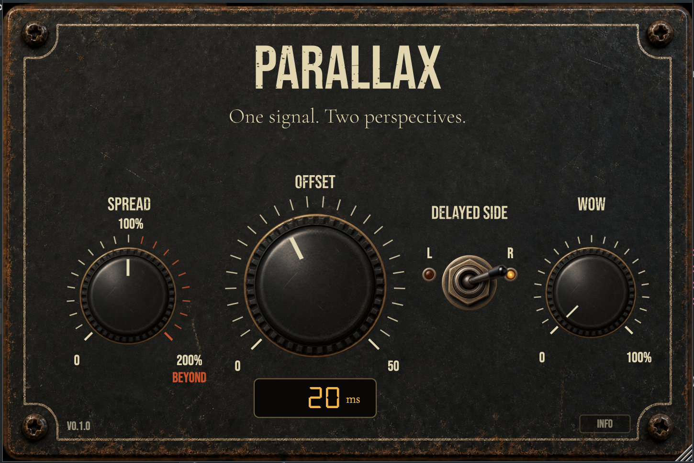

# PARALLAX

### Stereo Doubler

**One signal. Two perspectives.**



Parallax is a stereo temporal doubler that creates width, depth and movement by
placing the left and right channels at slightly different points in time.

It is not intended to produce a conventional echo. Instead, Parallax creates two
temporal perspectives of the same signal and lets you shape the space between
them.

> Parallax is currently in **0.1.0 beta testing**. Feedback from different hosts,
> sample rates and audio configurations is welcome.

## Features

- Adjustable temporal offset from `0` to `50 ms`
- Selectable delayed side: left or right
- Stereo width control from mono to `200%`
- Organic wow, drift and flutter modulation
- Smoothed parameter changes and fractional-delay interpolation
- Mono-to-stereo and stereo-to-stereo processing
- Resizable vintage-inspired interface
- VST3 and Audio Unit formats
- Parameter automation and project-state restoration

## Controls

| Control          | Description                                                                                                  |
| ---------------- | ------------------------------------------------------------------------------------------------------------ |
| **OFFSET**       | Sets the temporal distance between the direct and delayed perspectives, from `0` to `50 ms`.                 |
| **DELAYED SIDE** | Selects whether the left or right side receives the delayed perspective.                                     |
| **SPREAD**       | Controls the stereo Side component: mono at `0%`, natural stereo at `100%`, and extended width up to `200%`. |
| **WOW**          | Adds organic wow, drift and flutter to the delayed perspective.                                              |

## Audio configurations

Parallax supports:

- mono input to stereo output;
- stereo input to stereo output.

With a mono source, Parallax duplicates the input internally and creates two
temporal perspectives. With a stereo source, it preserves the original channels
and delays the selected side.

## Plugin formats

| Platform | Formats          | Status                                         |
| -------- | ---------------- | ---------------------------------------------- |
| macOS    | Audio Unit, VST3 | Beta testing                                   |
| Windows  | VST3 x64         | Build verified; field testing pending          |

Host compatibility will be documented as testing progresses. A successful build
does not by itself guarantee compatibility with every DAW.

## macOS installation

Parallax is not signed or notarized, so macOS may block it after installation.

1. Copy `Parallax.vst3` to `/Library/Audio/Plug-Ins/VST3/` and
   `Parallax.component` to `/Library/Audio/Plug-Ins/Components/`.
2. Open Terminal and run:

```bash
sudo xattr -dr com.apple.quarantine "/Library/Audio/Plug-Ins/VST3/Parallax.vst3"
sudo xattr -dr com.apple.quarantine "/Library/Audio/Plug-Ins/Components/Parallax.component"
```

3. Restart your DAW and rescan the plugins if necessary.

Only run these commands on a copy of Parallax downloaded from this official
repository.

### Building the macOS installer

After building the Release configuration, create the AU and VST3 installer with:

```bash
./Packaging/macOS/build-installer.sh
```

The resulting package is written to `Packaging/macOS/output/`.

## Building from source

### Requirements

- CMake `3.22` or newer
- A C++20-compatible compiler
- Xcode on macOS or Visual Studio 2026 on Windows

JUCE `9.0.1` is downloaded automatically by CMake during the first
configuration.

### macOS — Xcode

Generate the Xcode project:

```bash
cmake -S . -B build-xcode -G Xcode
```

Or build the Release configuration from the terminal:

```bash
cmake --build build-xcode --config Release
```

### Windows — Visual Studio 2026

The Visual Studio 18 generator requires CMake `4.2` or newer.

Generate a 64-bit Visual Studio solution:

```powershell
cmake -S . -B build-vs -G "Visual Studio 18 2026" -A x64
```

Open `build-vs/Parallax.sln` in Visual Studio, or build from the terminal:

```powershell
cmake --build build-vs --config Release
```

### Windows installer

Install [Inno Setup](https://jrsoftware.org/isinfo.php), build Parallax in Release
mode, then run:

```powershell
.\Packaging\Windows\build-installer.ps1
```

If PowerShell blocks local scripts, enable them for the current session only and
run the command again:

```powershell
Set-ExecutionPolicy -Scope Process -ExecutionPolicy Bypass
.\Packaging\Windows\build-installer.ps1
```

The installer is written to `Packaging\Windows\output\`. It installs
`Parallax.vst3` in `C:\Program Files\Common Files\VST3` and does not create an
uninstaller. The generated installer targets Windows x64 and can be built from
Visual Studio running natively in a Windows ARM virtual machine.

Parallax and its installer are currently unsigned. If Microsoft Defender
SmartScreen blocks the installer, choose **More info > Run anyway** only for a
copy downloaded from this official repository.

If a different Visual Studio version is installed, run `cmake --help` to see the
available generator names.

By default, CMake is configured with `PARALLAX_COPY_PLUGIN_AFTER_BUILD=ON`, so a
successful build attempts to copy the generated plugin to the standard system
plugin location. It can be disabled during configuration:

```bash
cmake -S . -B build -DPARALLAX_COPY_PLUGIN_AFTER_BUILD=OFF
```

## Testing status

The current beta is being tested for:

- plugin scanning and validation;
- mono-to-stereo and stereo-to-stereo operation;
- automation of every parameter;
- state save and restoration;
- multiple sample rates and buffer sizes;
- GUI resizing and repeated editor opening;
- long-running and multi-instance stability.

Validated DAWs and operating-system versions will be listed here after the field
testing phase.

## Notes

- `SPREAD` values above `100%` intentionally exaggerate the Side component and
  may reduce mono compatibility or increase channel peaks.
- `WOW` is deliberately creative at high settings.
- Parallax does not include a limiter. Manage downstream level when using extreme
  settings.

## Technology

Parallax is written in C++20 using JUCE and CMake. The DSP engine is separated
from the plugin wrapper, and includes a custom circular delay buffer, linear
fractional-delay interpolation, Mid/Side width processing and a multi-oscillator
wow modulator.

## License

Copyright © Simone De Angelis.

Parallax is licensed under the [GNU General Public License v3.0](LICENSE).
